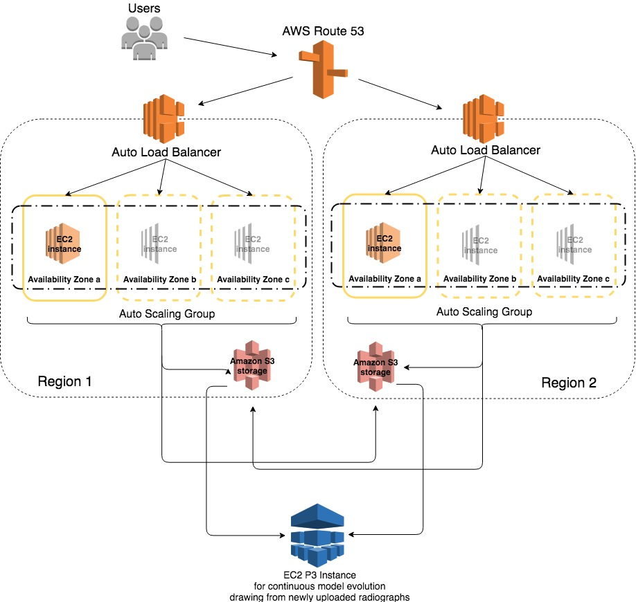

# Insightfuls_01
Development Operations to serve user submission of musculoskeletal radiographies to a Apache Spark Deep Learning evaluation and continued training application served on a Cloud network with an emphasis of maintaining site availability during infrastructure failures. 

# Background
Site reliablility is of primary importance for internet businesses. The company not only loses the revenue stream when a site is unavailable, but also depletes from its user base, fails to attract new customers, and potentially damages the company's reputation. DevOps best practices describe distributing infrastructure across multiple Availability Zones (AZ) within a Region, allowing data transfer across low-latency connections to mirrored servers that remain ready as backup. Webservices companies support such architectures by building computing centers across distinct geographical areas within the Region. Even with these built-in securities, entire regions can fail, and have done so due to various occurrences. The causes can involve administrative error. Though, natural disasters are likely to play more prominently in site-availability concerns as hurricanes reach further along the North American coast and fires rage through the West. Thus, a step beyond the prescribed best practices is to build multi-regional architectures. 

# Challenges for the DevOps professional
Failures due to server error within a resolution should be planned for by introducing redundancy and monitoring infrastructure. Though, failure of an entire AZ requires that users be shuttled to another Region, which is complicated by DNS servers that might prohibit rapidly shifting infrastructure. The DevOps professional is faced with waiting an unpredictable amount of time for a service provider to fix the facility or as long as 24-hours if the solution is to re-build infrastructure at a new IP address. 

# Demonstration of Best Practices and Infrastructure Preparedness
*Amazon AWS is used for the demonstration. This necessitates that AWS services and hardwares are cited, but general applications are implemented as much as possible. Further, my general interests lie in machine learning and artificial intelligence while my previous training is in the life sciences. To highlight these interests, I have chosen to model the classification of musculoskeletal radiographies. Yet, the models could be easily adapted for competitive intelligence focused on financial information, patent data, biomedical statistics, or cats.* 

  **Infrastructure as Code** will be built using **Terraform**, which allows straight forward planning and implementation that can be easily shared, edited, and versioned.  

#### Figure of planned infrastructure

  **Route 53** helps to make connections between domain names and IP addresses in different Regions. Route 53 also monitors the health of infrastructure across these Regions and routes traffic away from unhealthy resources. If all resources are optimally working, users can be routed based on their proximity to resources.  

  **Elastic Load Balancing** (elb) implements active redundancy and will be combined with **Auto Scaling** so that automated health checks facilitate the direction of traffic to healthy nodes that are automatically (re)balanced across a Region.

  **Amazon EC2** instances will be used to serve and host **Apache Spark**. Spark facilitates Deep Learning through a Spark MLlib. The Machine Learning library allows Tensorflow-backed Keras models to be plugged into Spark so that the models can be applied in a distributed and scaled model. 

  **Amazon S3** will be used to store new data as it is uploaded from a hospital professional, radiographer, or physician. This data will be pulled to a machine learning capable **EC2 P3** instance for continued training and evolution of the model which would then be integrated into other **EC2** instances for serving the application and receving the uploaded images. 

  ** **

  ** **

  ** **

# Leap Goal
Try to use the recursive DNS servers' eventual consistency to reduce the downtime of users in a stricken region by serving duplicate IP addresses to a single region. 

# Alternatives
While using multiple regions within Amazon AWS is a viable option in facilitating greater site availability, the solution ties its users to the vendor (and does so at greater costs to the user). Another option is to create infrastructure using multiple vendors such as AWS, GCP, Azure, OpenStack, VMware, and more. Terraform functions across mutliple vendors and additional enterprise software is available to manage such setups. 

The time to recover from a regional outage leaves a company dependent on the web services provider to resolve the problem or an estimated 24-hour period required for the recursive name servers to update it's collective cache if the user decides to mitigate the consequences by launching a new server. 

# References
MURA: Large Dataset for Abnormality Detection in Musculoskeletal Radiographs.
Pranav Rajpurkar*, Jeremy Irvin*, Aarti Bagul, Daisy Ding, Tony Duan, Hershel Mehta, Brandon Yang, Kaylie Zhu, Dillon Laird, Robyn L. Ball, Curtis Langlotz, Katie Shpanskaya, Matthew P. Lungren, Andrew Y. Ng

